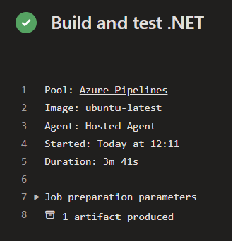

## Part 2 (Azure DevOps)

> Before we start, remember that "Azure DevOps" is a product: despite the name, it shouldn't be seen as a silver bullet and is neither sufficient nor necessary for "doing DevOps", even in Azure!

### Step 1 - Set Up Azure DevOps

To start, we'll set up an Azure DevOps (ADO) workspace within an ACloudGuru sandbox to explore this exercise.

Visit [the Cloud Sandboxes page in ACG](https://learn.acloud.guru/cloud-playground/cloud-sandboxes) now, and start an Azure Sandbox. Open that as guided, noting the instructions to open the Azure portal in an incognito browser to avoid contamination with any existing Microsoft accounts!

To create that ADO workspace:
* Search for `Azure DevOps Organizations` in the search bar from the https://portal.azure.com homepage and select "My Azure DevOps Organizations" or jump directly to <https://aex.dev.azure.com/>
* Provide any necessary details, and then create a new Organization
* Within that Organization, create a Private Project
* That's it, you now have an Azure DevOps project set up ready to start working!

### Step 2 - Explore Azure DevOps

Azure DevOps does many different things. From within the "Project" you set up, you should see several tabs on the left such as Overview, Boards and Repos. Of these, the most interesting right now are:

* **Boards**
  * Here ADO offers various structures of ticketing-boards, used for tracking work
  * It can be offer various powerful capabilities, such as managing "sprints", "backlogs" and generating analytics.
  * If you're interested, [see Microsoft's guidance for more information](https://learn.microsoft.com/en-gb/azure/devops/boards/?view=azure-devops)
* **Pipelines**
  * The core of today's workshop, ADO offers an interface for managing pipeline jobs that can be used for a variety of tasks including Continuous Integration.
  * Pipelines can be set up using either the "Classic Interface" or a YAML file. We will always encourage the use of the latter, to take advantage of codifying our pipelines
* **Repos**
  * ADO can be used as a standalone tool providing just pipelines or boards pointing at work being tracked separately, but is commonly also used to host the code itself in repositories (repos)

Take a couple of minutes to explore the different views available within your project, and familiarise yourself with the ADO interface.

### Step 3 - Get the code

Before we can create our pipelines, we need somewhere for the YAML file to be read from.

We typically want this to be stored directly alongside our codebase, so that we can manage changes between those seamlessly.

Within the Repos tab, you can click the "Import" button to import the existing GitHub repository: <https://github.com/corndeladmin/DevOps-Unit-5-Workshop.git>.

> Note at this stage that a single ADO _Project_ can hold multiple _repositories_: you can click on the repository list at the top (as per the image below) to add more.


### Step 4 - Creating your first ADO pipeline

Now that we have a repository, we can start to create our first pipeline!

We will default to cloning the repo onto your machine to work locally, but you could make changes directly through the web interface. 

To clone the repo:
* Select the correct repository first
* Then select the `Clone` button to find the repo URL (just as with GitHub)
* Clone that onto your machine as usual (e.g. `git clone <url> <folder name>`)

Open the repository in VS Code, and add a new file at the top level called `azure-pipelines.yml`.

Into that file, copy the following code:
```yml
# Here we specify what causes the pipeline to run; in this case changes to any branch
trigger:
- '*'

# Here we specify what type of machine (agent) to run on
pool: Default

# And here we specify a list of "jobs"
jobs:
  - job: firstJob
    displayName: "My first Job"
    # Each job has a sequence of steps to run
    steps:
      - script: echo "Hello World"
        displayName: Say Hello
      - task: Bash@3
        inputs:
          targetType: 'inline'
          script: echo "Hello World (again)"
```

Note that each step is defined as either a "script" or a "task".

**Scripts** specify a specific command to run, such as our `echo` command, or something more complex (including executing a script file!).

**Tasks** refer to a predefined module, typically built-in & provided by Microsoft. These can be useful for common requirements, such as installing a particular package, or interacting with the Azure platform.

[A list of Microsoft provided tasks can be viewed here.](https://learn.microsoft.com/en-us/azure/devops/pipelines/tasks/reference/?view=azure-pipelines)

Check you're working on the right branch and then commit & push this file.

Moving to the Pipelines view in ADO, we can now register our pipeline; unlike GitHub / GitLab, the pipeline doesn't automatically run just because we created a file with a magic name.

To create your pipeline:
* Click "Create Pipeline"
* Select "Azure Repos Git" as your code location.
* Select your repository
* It should then locate your pipeline file, and you can click "Run"

After a few seconds, you should see it has paused and a warning appears! Grant the pipeline permission to access the Default agent pool that we assigned it.

Now the pipeline will try to run and we see ... **a failure**!

Click into the job, and you should see an issue like:
> _No agent found in pool Default which satisfies the specified demands_

Unlike GitHub/GitLab, ADO doesn't automatically offer a free tier for running jobs. They will generally grant access to a single free Microsoft-hosted pipeline if [you apply for it](https://learn.microsoft.com/en-us/azure/devops/pipelines/troubleshooting/troubleshoot-start?view=azure-devops#check-for-available-parallel-jobs), but this can take a few business days to approve so won't work for us here.

> If you're curious why - a number of CI/CD tools have restricted their pipeline free tier over the last few years, seemingly due to a rise in abuse of those pipelines with [people using them to mine cryptocurrencies](https://devblogs.microsoft.com/devops/change-in-azure-pipelines-grant-for-public-projects/)!

We will therefore need to host a runner ourselves to give our pipelines somewhere to execute. Thankfully, we can do that directly on a VM hosted in our Azure cloud too.

### Step 4 - Set up a (self-hosted) Pipeline Runner

> The guidance we'll provide is based on the instructions you can find by visiting:
> * Project Settings (bottom left of the menu in ADO)
> * Pipelines -> Agent Pools
> * Click on the "Default" pool, and "New Agent"

In order to create and register your self hosted agent, we'll need access to:
* A PAT (Personal Access Token) for the agent to have permission to talk to ADO
* Your ADO organisation URL

You can generate the PAT by clicking on the User Settings (at the top right, by your initials) and visiting the Personal Access Tokens page. For simplicity here, we'll break best security practice and generate a PAT with "Full Access".

Make a note of the value - if you lose this it can't be recovered, although we can always generate a new one.

Your organisation name will be <https://dev.azure.com/\<YOUR TEMPORARY USERNAME HERE\>> e.g. https://dev.azure.com/clouduserblahblah11 (although you can change this if you want).

With those values at hand, [return to the Azure Portal](https://portal.azure.com) and search for "Deploy a Custom Template".

* From that page, select "Build your own template in the editor"
* [Locate the template](./ado_vm_template.json) and copy-paste the contents into the code-panel, overwriting any existing entries
* Hit Save and you should see a set of "Project Details" asking for some inputs:
  * Select the automatically created resource group (which will auto-populate the Region field)
  * Pick an app name (using alphanumerics only), such as `unit5pipelinerunner`
  * Enter your DevOps org URL, and your PAT token into the appropriate boxes
  * Hit to review and then start the deployment

> If there are any issues at this stage, reach out to the trainer running the session. We do not expect you to debug cloud deployments at this stage!

Once that says it has completed successfully, we can validate that by:
* Returning to [ADO's portal](https://dev.azure.com/) and entering your project
* Clicking on Project Settings at the bottom left
* Navigating to "Agent Pools" and the "Agents" tab under the "Default" Pool
* If you can now see an agent called `myAgent` reporting itself online - this bodes well!

Re-run your pipeline from the Pipelines tab, and check that it successfully completes.

### Step 5 - Extending the pipeline

Breathe! Although our pipeline is pretty basic at this stage, we've done a lot of work to configure our organisation, project, repo, pipeline and pipeline runner just to get that working! Now the structure is in place, we can really start to expand the pipeline itself.

As before, we want our pipeline to be able to verify that our application is in a working state.

Try extending your pipeline to cover all the scenarios so that it:
1. Builds the C# code.
1. Runs the C# tests.
1. Builds the TypeScript code.
1. Runs the linter on the TypeScript code.
1. Runs the TypeScript tests.

It's up to you how exactly you do this, but consider:
* Can you install the appropriate version of DotNet and Node using [the provided tasks](https://learn.microsoft.com/en-us/azure/devops/pipelines/tasks/reference/?view=azure-pipelines)
* Do you want to use scripts or tasks for the other steps?
* Check the [list of options](https://learn.microsoft.com/en-us/azure/devops/pipelines/yaml-schema/steps-script?view=azure-pipelines) on the `script` task - are there any that we should set for any of your steps?
* Do you need the C# & TypeScript steps to run on the same agent?
  * If we had multiple agents, could we parallelise them?
  * Should we?

## Stretch

### (Stretch Goal) Publish an artifact

Sometimes we want our pipelines to produce a file - maybe a binary executable for our deployment, or some reporting. Have a go at generating an output from your CI pipeline and publishing it.

You may want to use the command below to generate the executable, and the [Publish Artifact task](https://learn.microsoft.com/en-us/azure/devops/pipelines/tasks/reference/publish-pipeline-artifact-v1?view=azure-pipelines):
```sh
# This will rely on both dotnet & npm being present on the agent 
dotnet publish -c Release -o /dist
```

Once the job is succeeding, you should be able to see a link to the artifact in the job output:



Click the link & check something sensible has been stored.

### (Stretch Goal) Track our changes!

So far we've just been getting on with the work, but we really ought to be tracking it carefully. Let's see how ADO can help us track the work.

This project is currently configured to have the Boards use the "Basic" process - ADO offers several in-built flows so you may work with different terminology; [Azure offer more info on those here](https://learn.microsoft.com/en-us/azure/devops/boards/work-items/guidance/choose-process?view=azure-devops&tabs=agile-process#default-processes).

Go to "Boards" and raise a new "Work Item" of type "Feature". Give yourself a simple task, such as "Change the text on the homepage".

Take a moment to look at what fields are offered to be tweaked, such as the state ("To Do"), the priority, and a more detailed description, then save the issue.

Make a note of the issue number, and check that appears as you'd expect on the "Boards" view. One nice feature of ADO is that we can easily associate branches, PRs and individual commits with work items. First, check this is enabled for your repository through:
* Project Settings
* Repositories -> your repo
* Settings
* Check "Commit mention linking" is on

> You may notice that we can take this one step further, as there's also an option for:
> "Commit mention work item resolution" which "Allows mentions in commit comments to close work items (e.g. "Fixes #123")."
> Leave this off for now

Now move the ticket into the "Doing" stage, and then get going!

Make a small visible change to the code, for example change the `First Page!` title in `DotnetTemplate.Web\Views\Home\FirstPage.cshtml`. When you're ready to make the change, make sure to include `#<issue_number>` as part of your commit message, e.g.:
```bash
git commit -m "#14 Change the homepage text"
```

Push your change to main, and check the build succeeds. If you open the ticket, can you see a link to the relevant commit?

### (Stretch goal) Slack notifications

To make sure people are aware when there are issues with the build, it can be useful to send a notification at the end of the workflow.

There are many notification platforms we might use for this:
* Emails
* Instant messaging (Teams, Slack etc.)
* Dedicated pagers

Many of these require appropriate permissions or paid services, so for today we'll try out Slack on a free tier.

**If you haven't already, please create your own personal slack workspace for this part of the exercise. This is free and can be set up [here](https://slack.com/create).**

Have a go at following [the Azure advice for integrating your pipeline with Slack](https://learn.microsoft.com/en-us/azure/devops/pipelines/integrations/slack?view=azure-devops).